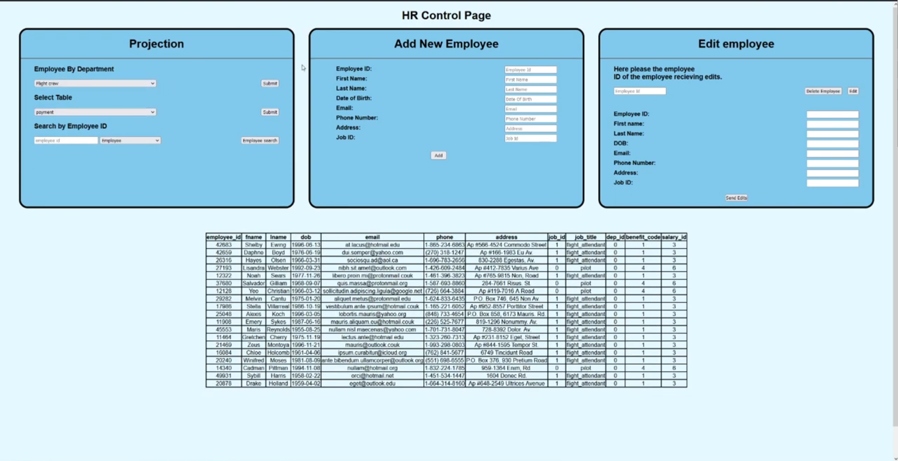

# Restful API used to access database

# What is this

This project what part of out databases class at UH where we were tasked with designing a relational database from the ground up, create and a front end UI for it and conenct it to the backend through the rest API. Full updates of the table can be easily made through the UI such as viewing employee information, adding a new employee, and seeing other HR related data in relation to their role/position.

### Old stuff
  Hopefully everything goes off without a hitch.
   To run the files all we really had to do was install nodemon. I believe express and cors are baked into npm.
  
  sudo apt-get install nodemon
  
  We run the project inside the root directory with these commands
  
  npx nodemon index.js
  
  Then on a browser, we load up localhost:3000 and you should be directed to the page.
  
  Hopefully That is all that is needed
  Any other bugs or quirks of running the server, message Anthony Ciocco 1600875, dbs018 for information.
  
  Link to the video:
  https://www.youtube.com/watch?v=AleFXVttZ4E
  
